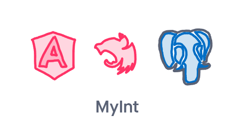

 

# MeAndBro

This project was generated using [Nx](https://nx.dev).

## Setting up workspace for development

- You need to have node installed on your system. (Get it from https://nodejs.org/en/download/, this also installs npm along with node)
- You need a descent text editor (We are using VS Code, get it at https://code.visualstudio.com/download)
- Need `commitzen` to organize commit messages (You can have it globally by running `npm install commitizen -g`)
- Clone the repository and cd into repo `cd me-and-bro`
- To install all the dependencies of the project run `npm run install` (You need to have no errors till this point to proceed further)

## Starting the application

- Run `ng serve my-int` for a frontend dev server. Navigate to http://localhost:4200/. The app will automatically reload if you change any of the source files.
- Run `npx nx serve api` for a backend dev server. The server is running at http://localhost:3333/
- You are all set, start hacking 🎉🎉 (Just remember to use `git cz` when contributing to repo)

## Build

Run `ng build my-int` to build the project. The build artifacts will be stored in the `dist/` directory. Use the `--prod` flag for a production build.

## Running unit tests

Run `ng test my-int` to execute the unit tests via [Jest](https://jestjs.io).

Run `nx affected:test` to execute the unit tests affected by a change.

## Running end-to-end tests

Run `ng e2e my-int` to execute the end-to-end tests via [Cypress](https://www.cypress.io).

Run `nx affected:e2e` to execute the end-to-end tests affected by a change.

## Understand your workspace

Run `nx dep-graph` to see a diagram of the dependencies of your projects.

## Further help

Visit the [Nx Documentation](https://nx.dev/angular) to learn more.
